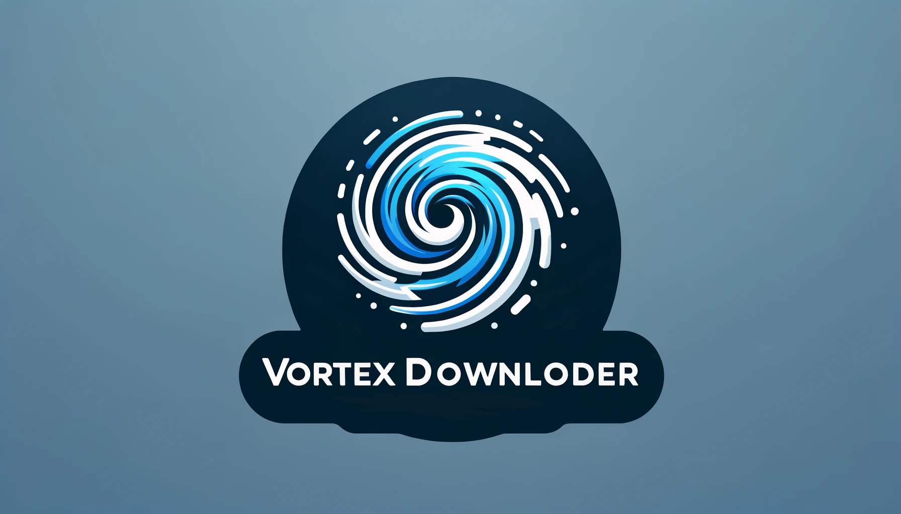

# VortexDownloader

VortexDownloader es una aplicación de servidor diseñada para facilitar el intercambio de archivos de
manera rápida y sencilla. Con esta aplicación, puedes generar URLs para los archivos almacenados en
la carpeta `public/shared`, lo que permite a otras personas descargar esos archivos sin necesidad de
subirlos a servicios de alojamiento externos como Google Drive o MediaFire. La velocidad de descarga
dependerá de la conexión del usuario que esté ejecutando el servidor.

## Características principales

- Genera URLs para archivos almacenados en la carpeta `dist/public/shared`.
- Facilita el intercambio rápido de archivos de una PC a otra.
- Interfaz de usuario que muestra un índice de archivos disponibles.
- Proporciona un JSON con todos los archivos y sus respectivas URLs.
- Desarrollado con Node.js y TypeScript.
- Implementación de Docker para facilitar la distribución y ejecución del servidor.

## Requisitos

- Node.js: Asegúrate de tener Node.js instalado en tu sistema.
- TypeScript: Necesitas TypeScript para compilar el código.
- Docker (opcional): Puedes utilizar Docker para ejecutar la aplicación en un contenedor si lo
  prefieres.

## Instalación

1. Clona este repositorio en tu máquina local:
   `git@github.com:JonathanCastillo-dv/VortexDownloader.git`

2. Navega al directorio del proyecto: `cd VortexDownloader`

3. Instala las dependencias: `npm install`

## Uso

1. Asegúrate de que los archivos que deseas compartir se encuentren en la carpeta `dist/public/shared`.

2. Inicia el servidor:

`npm run start`

O utiliza Docker (si está configurado)

Desde aquí, podrás ver la lista de archivos disponibles y generar URLs para ellos.

4. Para compartir un archivo, simplemente copia la URL generada y compártela con la persona que
   desees.

## Notas adicionales

- Este proyecto está en constante desarrollo y se agregarán mejoras adicionales en el futuro.
- Puedes exponer el servidor a Internet utilizando herramientas como ngrok o configurando tu propio
  servidor web si lo necesitas.
